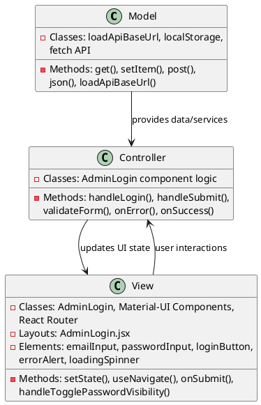
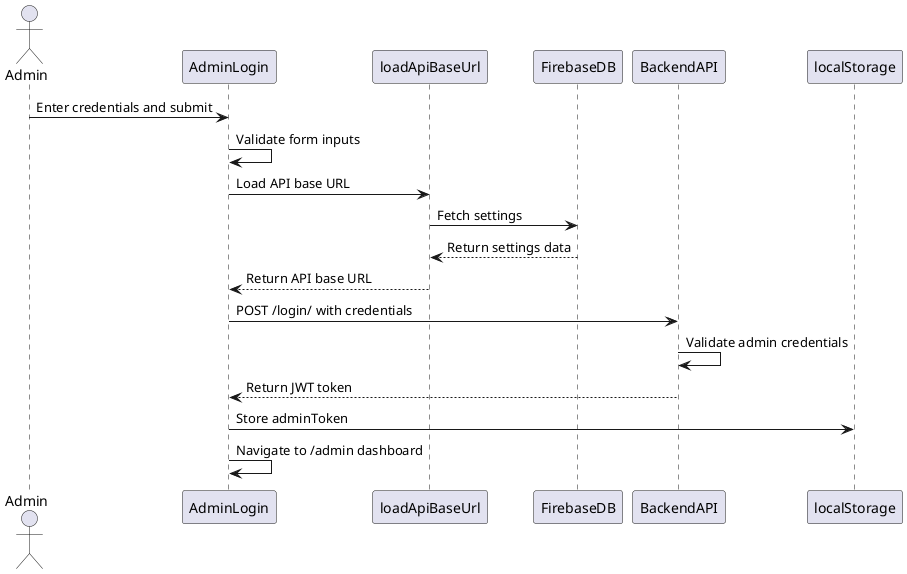

# 5.1 Admin Authentication

## Front-end Components

- **AdminLogin**: Authentication form component
  - Material-UI form fields for email/password input
  - Password visibility toggle functionality
  - Loading states and error handling display
  - Admin-themed UI with branding elements

- **Material-UI Components**: UI component library
  - TextField with email and password inputs
  - Button for form submission with loading states
  - Alert component for error message display
  - Card layout for login form container

- **React Router**: Navigation management
  - useNavigate hook for programmatic navigation
  - Route protection and redirect after authentication
  - Admin dashboard route access control

## Back-end Components

- **API Authentication Service**: Backend authentication endpoint
  - Token-based authentication system
  - Admin user credential validation
  - JWT token generation and return
  - Error handling for invalid credentials

- **Firebase Configuration Loader**: Dynamic API URL management
  - loadApiBaseUrl() function for configuration loading
  - Firebase Realtime Database settings retrieval
  - Fallback mechanisms for configuration failures
  - Cached API URL management

- **Local Storage**: Client-side token persistence
  - JWT token storage after successful authentication
  - Automatic token inclusion in subsequent API calls
  - Secure token management and cleanup

- **HTTP Client**: Fetch API for backend communication
  - POST requests to authentication endpoint
  - JSON payload handling for credentials
  - Response parsing and error management
  - Network failure handling

## Plant UML Diagrams

### Class Diagram (MVC Model)



### Sequence Diagram



### Data Design Diagram

```plantuml
@startuml Admin Authentication Data Design Diagram

database "Firebase Realtime Database" as FirebaseDB {
  settings : Settings
}

class Settings {
  +backendUrl : String
  +apkDownloadUrl : String
  +lastUpdated : timestamp
}

class LoginCredentials {
  +email : String <<required>>
  +password : String <<required>>
}

class AuthResponse {
  +token : String <<JWT>>
  +expiresAt : timestamp
  +adminId : String
}

class AdminToken {
  +token : String
  +storedAt : timestamp
  +expiresAt : timestamp
}

LoginCredentials --> BackendAPI : sent to
BackendAPI --> AuthResponse : returns
AuthResponse --> AdminToken : stored as
FirebaseDB --> Settings : provides configuration

@enduml
