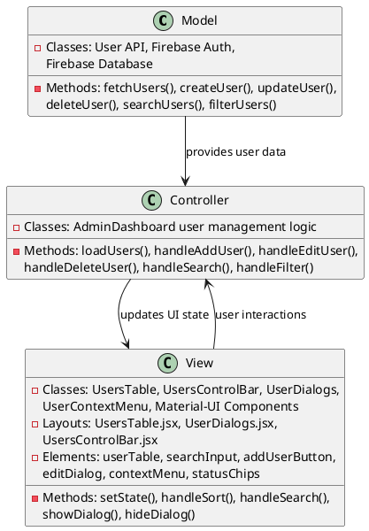
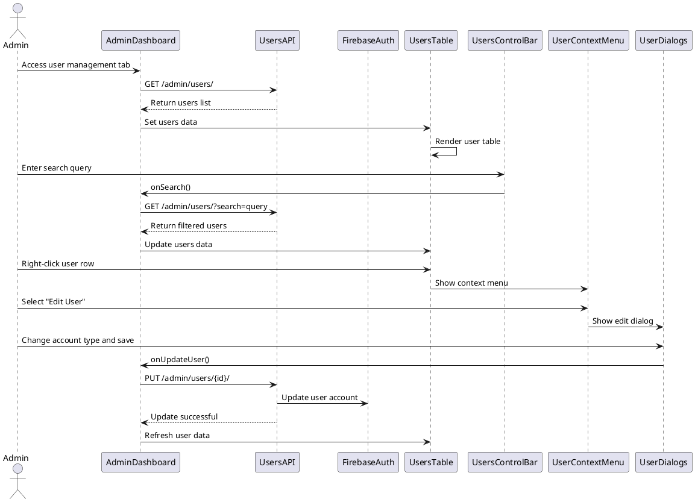

# 5.2 User Management

## Front-end Components

- **UsersTable**: User data display component
  - Data table with sortable columns (username, email, account type, status)
  - User status indicators (online/offline chips)
  - Account type badges (Premium/Free)
  - Row selection and context menu triggers

- **UsersControlBar**: User management toolbar
  - Search functionality with real-time filtering
  - Add user button and account type filters
  - Sort controls for different user attributes
  - Bulk operation controls

- **UserDialogs**: Modal dialogs for user operations
  - Add user dialog with email/password fields
  - Edit user dialog for account type changes
  - User details dialog with comprehensive user information
  - Confirmation dialogs for destructive operations

- **UserContextMenu**: Right-click context menu
  - Edit user account type options
  - View detailed user information
  - Send password reset emails
  - Delete user operations

## Back-end Components

- **User Management API**: Backend user CRUD operations
  - GET /admin/users/ - Retrieve paginated user list
  - POST /admin/users/ - Create new user accounts
  - PUT /admin/users/{id}/ - Update user information
  - DELETE /admin/users/{id}/ - Remove user accounts

- **Firebase Authentication Integration**: User account management
  - Firebase Auth user creation/deletion
  - Password reset email functionality
  - User profile data synchronization
  - Account status management

- **Real-time User Data**: Live user information updates
  - Firebase Realtime Database user data
  - Online/offline status tracking
  - Last login timestamp updates
  - Profile image URL management

- **Search and Filtering**: Server-side user queries
  - Email and username search capabilities
  - Account type filtering (free/premium)
  - Online status filtering
  - Date range filtering for registration/login dates

## Plant UML Diagrams

### Class Diagram (MVC Model)



### Sequence Diagram



### Data Design Diagram

```plantuml
@startuml User Management Data Design Diagram

database "Firebase Realtime Database" as FirebaseDB {
  users/{userId} : UserProfile
}

database "Firebase Auth" as FirebaseAuth {
  userId : String <<PK>>
  email : String <<unique>>
  emailVerified : boolean
  createdAt : timestamp
}

class UserProfile {
  +userId : String <<PK>>
  +username : String
  +email : String <<FK>>
  +profileImageUrl : String
  +language : String
  +accountType : String <<free/premium>>
  +createdAt : String
  +lastLoginDate : String
  +translator : String
  +lastMessage : String
  +lastMessageTime : Long
}

class UserSearchFilter {
  +searchQuery : String
  +accountTypeFilter : String
  +onlineStatusFilter : boolean
  +dateRange : DateRange
}

class UserManagementAction {
  +actionType : String <<create/update/delete>>
  +userId : String
  +newData : Object
  +timestamp : Long
}

UserSearchFilter --> UserProfile : filters results
UserManagementAction --> FirebaseAuth : modifies accounts
UserManagementAction --> UserProfile : updates data
FirebaseAuth --> UserProfile : provides authentication

@enduml
```
