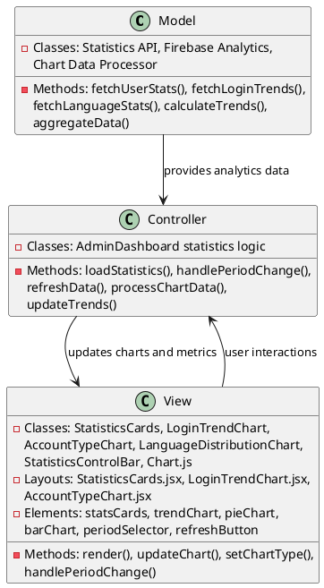
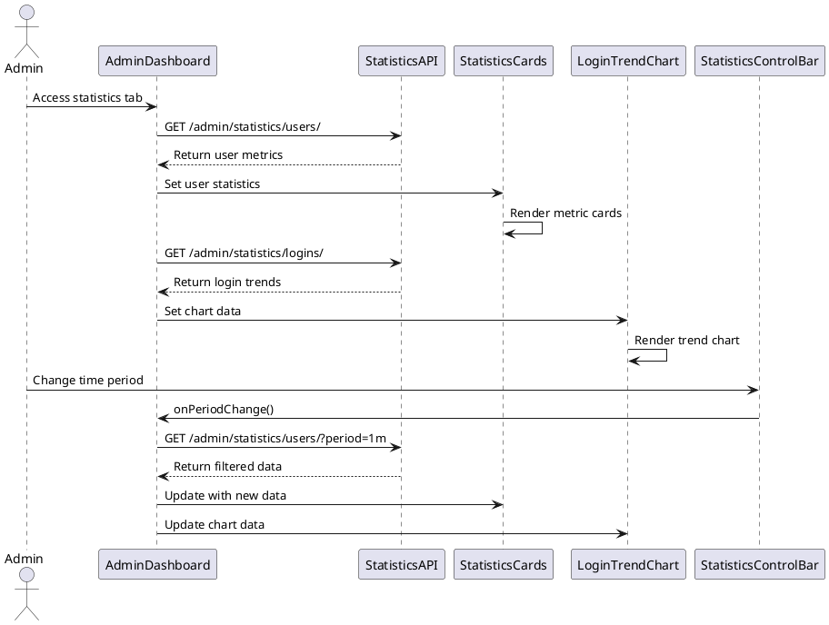
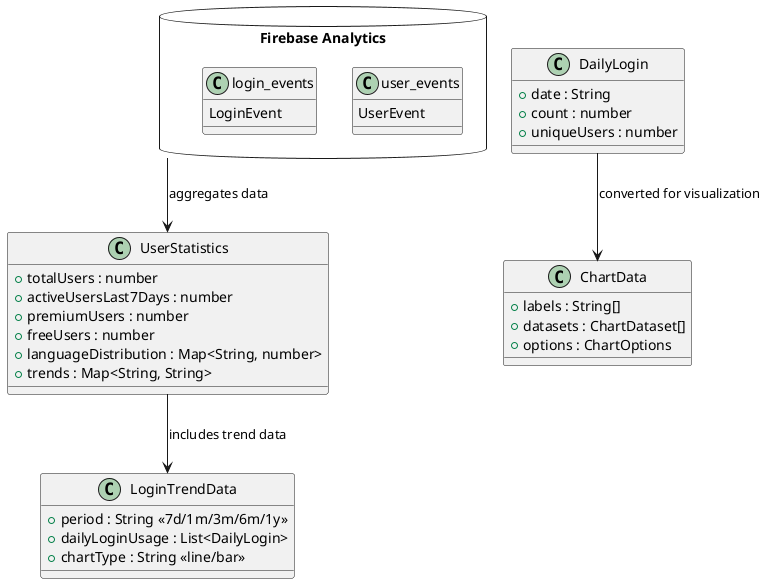

# 5.3 Usage Statistics

## Front-end Components

- **StatisticsCards**: Key metrics display component
  - Total users, active users, premium/free user counts
  - Trend indicators with color-coded arrows
  - Gradient card backgrounds with custom shadows
  - Responsive grid layout for different screen sizes

- **LoginTrendChart**: Login activity visualization
  - Line and bar chart toggle functionality
  - Time period selectors (7 days, 1 month, 3 months, etc.)
  - Interactive chart with hover tooltips
  - Chart.js integration with custom styling

- **AccountTypeChart**: User distribution pie chart
  - Premium vs Free account type visualization
  - Percentage breakdowns with color coding
  - Interactive legend and tooltips
  - Doughnut chart style with center text

- **LanguageDistributionChart**: Language usage analytics
  - Horizontal bar chart of user language preferences
  - Percentage calculations and display
  - Color-coded bars for different languages
  - Responsive chart scaling

- **StatisticsControlBar**: Analytics controls and filters
  - Time period selection dropdown
  - Refresh data functionality
  - Loading state indicators
  - Period label updates based on selection

## Back-end Components

- **Usage Statistics API**: Analytics data endpoints
  - GET /admin/statistics/users/ - User metrics and trends
  - GET /admin/statistics/logins/ - Login activity data
  - GET /admin/statistics/languages/ - Language distribution
  - GET /admin/statistics/accounts/ - Account type breakdowns

- **Firebase Analytics Integration**: Real-time data aggregation
  - User registration tracking across time periods
  - Login event logging and timestamp recording
  - Account type changes and user status updates
  - Language preference data collection

- **Time-based Data Processing**: Period filtering and aggregation
  - Date range calculations for different periods
  - Data aggregation by day/week/month
  - Trend calculation algorithms (percentage changes)
  - Cache management for performance optimization

- **Chart Data Formatting**: Visualization data preparation
  - Chart.js compatible data structure creation
  - Label generation and formatting
  - Color scheme application
  - Tooltip and legend data preparation

## Plant UML Diagrams

### Class Diagram (MVC Model)

### Sequence Diagram

### Data Design Diagram

