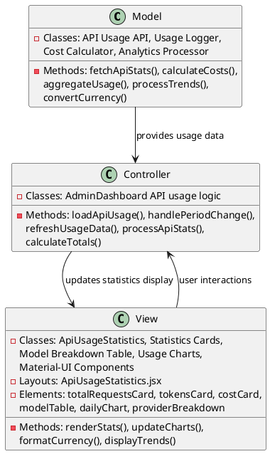
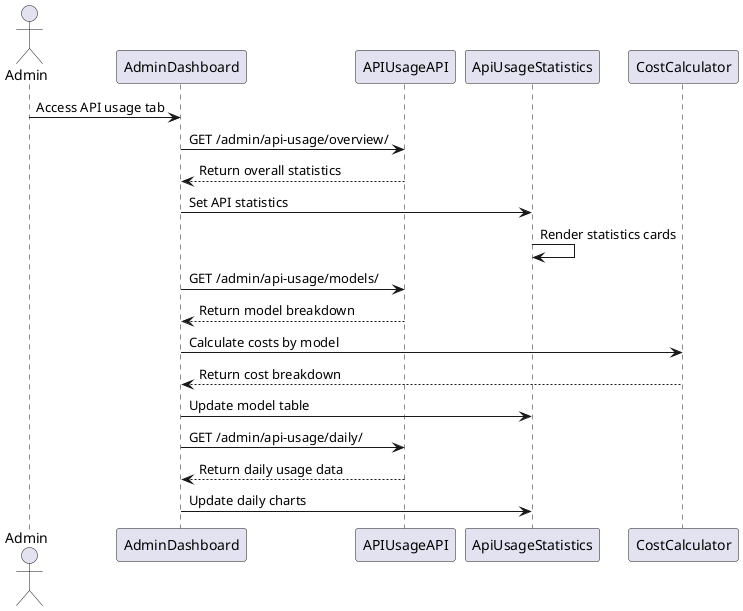
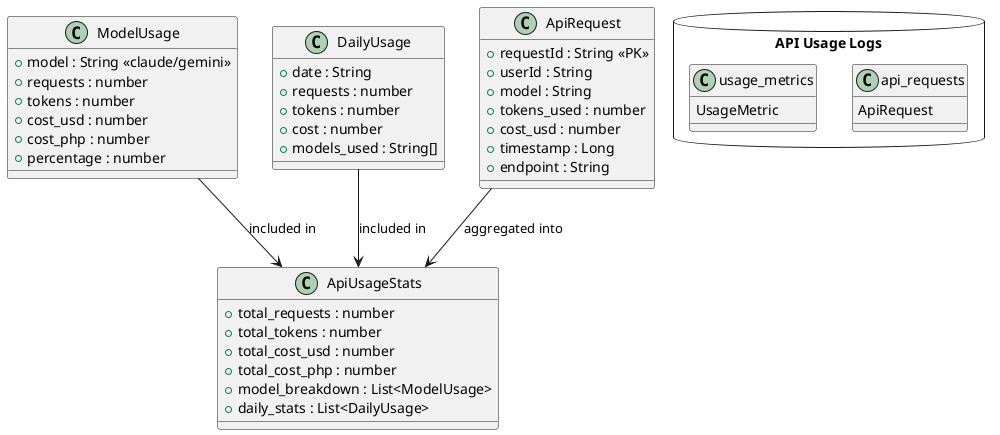

# 5.4 API Usage

## Front-end Components

- **ApiUsageStatistics**: API analytics dashboard component
  - Overall statistics cards showing total requests, tokens, and costs
  - Model breakdown table with usage by AI provider
  - Daily usage charts and trends
  - Currency conversion display (USD to PHP)

- **Statistics Cards**: API metrics display
  - Total API requests counter with large typography
  - Total tokens used across all API calls
  - Cost breakdown with currency formatting
  - Provider-specific usage indicators

- **Model Breakdown Table**: AI provider usage details
  - Tabular display of Claude vs Gemini API usage
  - Cost per model with percentage breakdowns
  - Usage statistics and token consumption
  - Color-coded provider identification

- **Daily Usage Charts**: Time-based API consumption
  - Daily API call volume visualization
  - Token usage trends over time
  - Cost accumulation charts
  - Interactive chart controls and filtering

## Back-end Components

- **API Usage Tracking API**: Usage analytics endpoints
  - GET /admin/api-usage/overview/ - Overall API statistics
  - GET /admin/api-usage/models/ - Model-specific breakdown
  - GET /admin/api-usage/daily/ - Daily usage trends
  - GET /admin/api-usage/costs/ - Cost analysis data

- **API Usage Logging**: Real-time usage tracking
  - Translation API call interception and logging
  - Token consumption recording per request
  - Cost calculation based on provider pricing
  - Request metadata storage (user, timestamp, model)

- **Cost Calculation Engine**: Pricing and billing logic
  - Dynamic pricing based on AI provider rates
  - Currency conversion (USD to PHP) with exchange rates
  - Token-based cost calculation algorithms
  - Cost aggregation by time periods and providers

- **Usage Analytics Processing**: Data aggregation and reporting
  - Time-based usage aggregation (daily, weekly, monthly)
  - Model performance and cost efficiency analysis
  - User-based API usage tracking
  - Trend analysis and forecasting

## Plant UML Diagrams

### Class Diagram (MVC Model)

### Sequence Diagram

### Data Design Diagram

