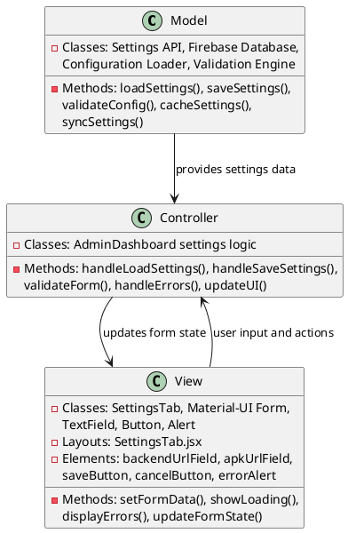
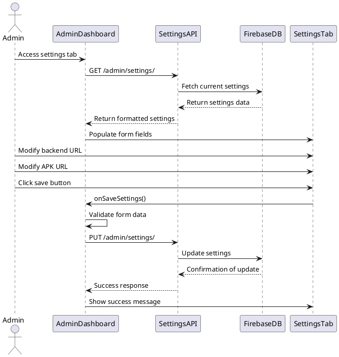

# 5.5 System Settings

## Front-end Components

- **SettingsTab**: System configuration interface
  - Text input fields for backend URL and APK download URL
  - Form validation and error handling
  - Save and cancel action buttons
  - Loading states during configuration updates

- **Form Controls**: Input components for settings
  - Backend URL text field with validation
  - APK download URL text field
  - Material-UI form components with proper styling
  - Input validation feedback

- **Action Buttons**: Configuration management controls
  - Save settings button with loading state
  - Cancel changes functionality
  - Confirmation dialogs for sensitive changes
  - Success/error notification display

## Back-end Components

- **Settings Management API**: Configuration endpoints
  - GET /admin/settings/ - Retrieve current system settings
  - PUT /admin/settings/ - Update system configuration
  - Configuration validation and sanitization
  - Settings persistence and caching

- **Firebase Configuration Storage**: Settings persistence
  - Firebase Realtime Database settings storage
  - Real-time settings synchronization
  - Configuration backup and versioning
  - Settings access control and permissions

- **Dynamic Configuration Loading**: Runtime configuration management
  - API base URL dynamic loading from Firebase
  - Fallback mechanisms for configuration failures
  - Configuration caching for performance
  - Real-time configuration updates

- **System Integration**: Settings application across components
  - API endpoint URL configuration for all services
  - APK download URL management for mobile app updates
  - Configuration propagation to dependent systems
  - Settings validation and error handling

## Plant UML Diagrams

### Class Diagram (MVC Model)



### Sequence Diagram



### Data Design Diagram

```plantuml
@startuml System Settings Data Design Diagram

database "Firebase Realtime Database" as FirebaseDB {
  settings : SystemSettings
}

class SystemSettings {
  +backendUrl : String
  +apkDownloadUrl : String
  +lastUpdated : timestamp
  +updatedBy : String
  +version : number
}

class SettingsForm {
  +backendUrl : String
  +apkDownloadUrl : String
  +isValid : boolean
  +errors : Map<String, String>
}

class ValidationRules {
  +backendUrlPattern : Regex
  +apkUrlPattern : Regex
  +requiredFields : String[]
}

class SettingsUpdate {
  +action : String <<create/update/delete>>
  +oldValues : SystemSettings
  +newValues : SystemSettings
  +timestamp : Long
  +userId : String
}

SettingsForm --> ValidationRules : validated against
SystemSettings --> SettingsUpdate : tracked in
SettingsUpdate --> FirebaseDB : stored in

@enduml
