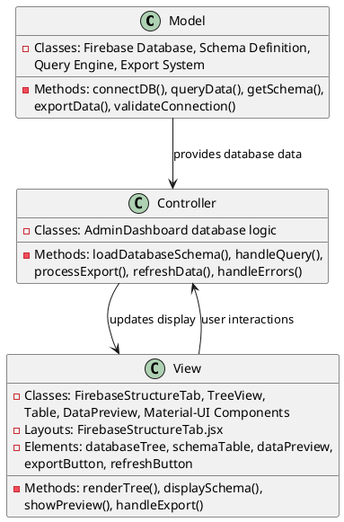
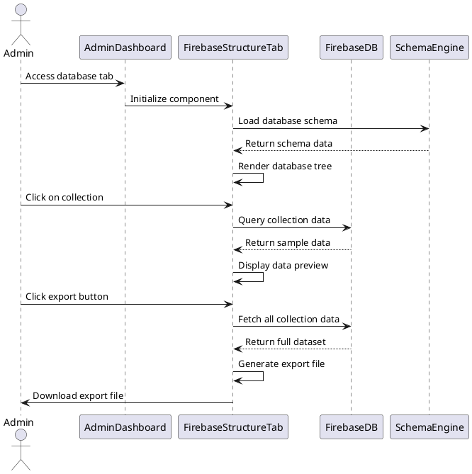

# 5.6 Database

## Front-end Components

- **FirebaseStructureTab**: Database visualization interface
  - Interactive database structure display
  - Expandable table and collection views
  - Field descriptions and data types
  - Real-time data preview capabilities

- **Database Tree View**: Hierarchical data structure display
  - Folder-based navigation for database collections
  - Table icons for different data entities
  - Expandable sections for detailed field information
  - Color-coded data type indicators

- **Field Documentation**: Schema information display
  - Field names, types, and descriptions
  - Primary key and foreign key indicators
  - Indexed field highlighting
  - Relationship visualizations

- **Data Preview**: Sample data viewing capabilities
  - Real-time data fetching from Firebase
  - Table format display of collection contents
  - Limited result sets for performance
  - Data export functionality

## Back-end Components

- **Firebase Database Access**: Direct database connectivity
  - Firebase Realtime Database SDK integration
  - Real-time data synchronization
  - Query operations for data retrieval
  - Connection management and error handling

- **Schema Definition**: Database structure metadata
  - Predefined table and collection schemas
  - Field type definitions and constraints
  - Relationship mappings between entities
  - Documentation and description storage

- **Data Query Engine**: Database querying capabilities
  - Collection and document retrieval
  - Filtering and sorting operations
  - Pagination for large datasets
  - Query performance optimization

- **Data Export System**: Database content export functionality
  - JSON export of collection data
  - CSV format generation for tabular data
  - Selective data export options
  - Export size limitations and warnings

## Plant UML Diagrams

### Class Diagram (MVC Model)



### Sequence Diagram



### Data Design Diagram

```plantuml
@startuml Database Data Design Diagram

database "Firebase Realtime Database" as FirebaseDB {
  users : UserCollection
  connect_chats : ChatCollection
  connection_requests : RequestCollection
  usage_statistics : StatsCollection
  settings : SettingsCollection
}

class DatabaseSchema {
  +tables : List<TableDefinition>
  +relationships : List<Relationship>
  +version : String
  +lastUpdated : timestamp
}

class TableDefinition {
  +name : String
  +icon : String
  +description : String
  +fields : List<FieldDefinition>
}

class FieldDefinition {
  +name : String
  +type : String
  +description : String
  +isPrimaryKey : boolean
  +isIndexed : boolean
  +isRequired : boolean
}

class DataExport {
  +collectionName : String
  +format : String <<json/csv>>
  +data : Object[]
  +timestamp : Long
  +recordCount : number
}

DatabaseSchema --> TableDefinition : defines
TableDefinition --> FieldDefinition : contains
FirebaseDB --> DataExport : source for
