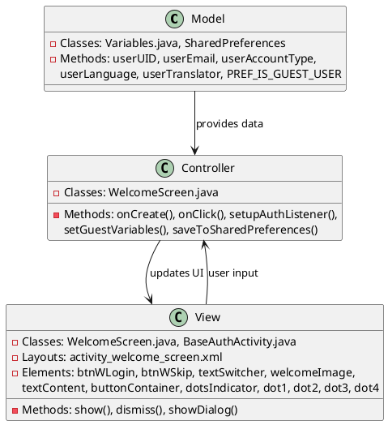
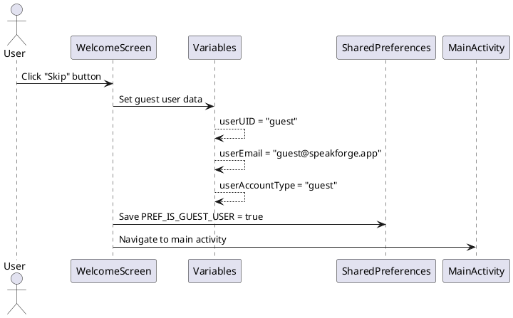
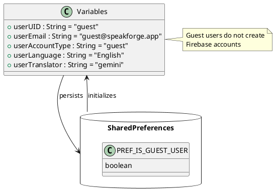

# 1.1 Guest Login

## Front-end Components

- **WelcomeScreen Activity**: Main welcome screen that displays guest login option
  - btnWSkip Button: Button to skip authentication and login as guest
  - TextSwitcher: Displays app features during guest login flow
  - Animation components: Fade and scale animations for UI transitions

- **UI Layout (activity_welcome_screen.xml)**: Layout containing welcome image, feature text, and login buttons
  - ImageView: App logo display
  - Button components: Login and Skip buttons
  - TextSwitcher: Dynamic feature descriptions

## Back-end Components

- **Variables Class**: Stores guest user session data
  - userUID: Set to "guest" for guest sessions
  - userEmail: Set to "guest@speakforge.app"
  - userAccountType: Set to "guest"
  - userLanguage: Default "English"
  - userTranslator: Default "gemini"

- **SharedPreferences**: Persistent storage for guest user state
  - PREF_IS_GUEST_USER: Boolean flag indicating guest login status
  - Stores guest session across app restarts

## Plant UML Diagrams

### Class Diagram (MVC Model)

### Sequence Diagram

### Data Design Diagram

