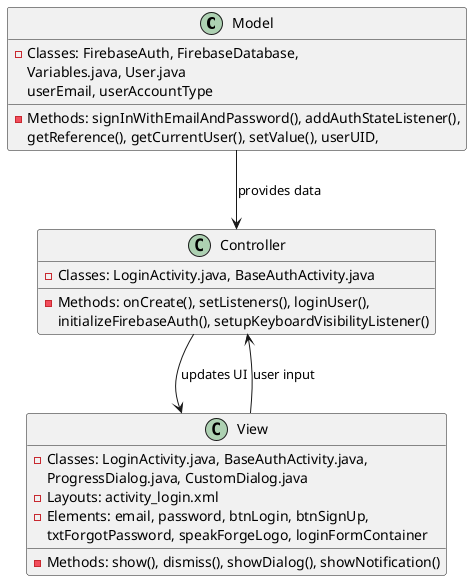
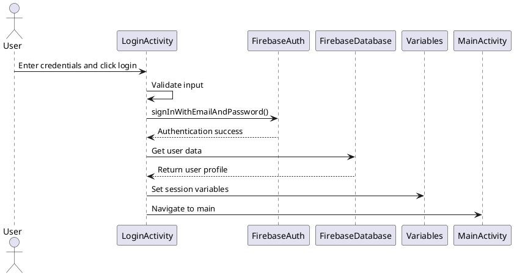

# 1.2 Login with Credentials

## Front-end Components

- **LoginActivity**: Main login screen extending BaseAuthActivity
  - Email EditText: Input field for user email address
  - Password EditText: Input field for user password
  - Login Button: Triggers authentication process
  - Sign Up Button: Navigates to registration screen
  - Forgot Password TextView: Links to password recovery

- **BaseAuthActivity**: Base class providing common authentication UI elements
  - Logo ImageView: App branding with tap-to-return functionality
  - Form animations: Fade-in and slide-up transitions
  - Keyboard visibility handling

- **UI Components**:
  - ProgressDialog: Loading indicator during authentication
  - CustomDialog: Error/success message displays
  - CustomNotification: Toast notifications for login status

## Back-end Components

- **FirebaseAuth**: Firebase authentication service
  - signInWithEmailAndPassword(): Authenticates user credentials
  - AuthStateListener: Monitors authentication state changes
  - FirebaseUser: Represents authenticated user information

- **FirebaseDatabase**: Real-time database for user data storage
  - users/{userId} reference: User profile data retrieval
  - lastLoginDate updates: Tracks user login timestamps
  - ValueEventListener: Handles database read operations

- **Variables Class**: Application-wide user session storage
  - Stores authenticated user data (UID, email, account type)
  - Maintains user preferences and settings

## Plant UML Diagrams

### Class Diagram (MVC Model)



### Sequence Diagram


### Data Design Diagram

```plantuml
@startuml Login with Credentials Data Design Diagram

database "Firebase Auth" as Auth {
  userId : String <<PK>>
  email : String
  emailVerified : boolean
  createdAt : timestamp
}

database "users/{userId}" as UserDB {
  userId : String <<PK>>
  email : String <<FK>>
  language : String
  accountType : String
  lastLoginDate : String
  translator : String
}

class Variables {
  +userUID : String
  +userEmail : String
  +userAccountType : String
  +userLanguage : String
}

Auth --> UserDB : creates entry
UserDB --> Variables : populates
Variables --> Auth : references

@enduml