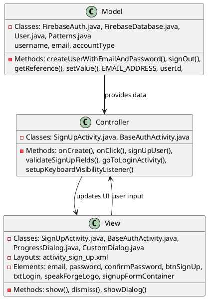
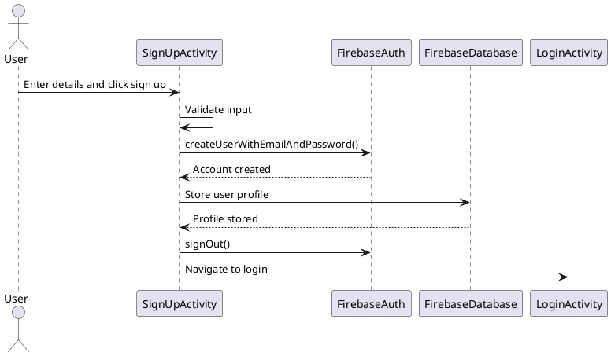
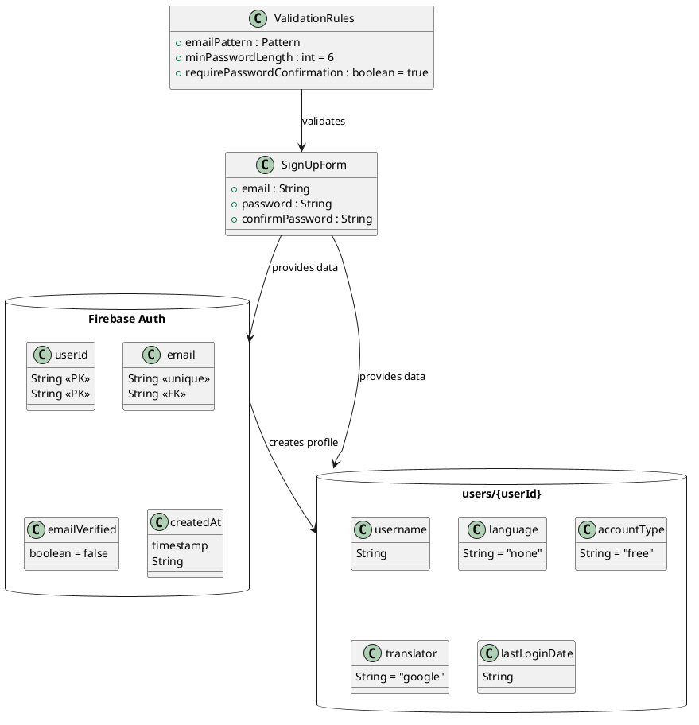

# 1.3 Sign Up

## Front-end Components

- **SignUpActivity**: Main registration screen extending BaseAuthActivity
  - Email EditText: Input field for user email address
  - Password EditText: Input field for user password
  - Confirm Password EditText: Input field for password confirmation
  - Sign Up Button: Triggers account creation process
  - Login TextView: Link to return to login screen

- **BaseAuthActivity**: Base class providing common authentication UI elements
  - Logo ImageView: App branding with scale-fade animations
  - Form container: Holds registration form with slide-up animation
  - Keyboard visibility handling for dynamic UI adjustments

- **UI Components**:
  - ProgressDialog: Loading indicator during account creation
  - CustomDialog: Success/error message displays
  - AnimationUtils: Scale-fade and slide-up transitions

## Back-end Components

- **FirebaseAuth**: Firebase authentication service
  - createUserWithEmailAndPassword(): Creates new user account
  - signOut(): Signs out user after successful registration
  - FirebaseAuthUserCollisionException: Handles duplicate email errors

- **FirebaseDatabase**: Real-time database for user profile storage
  - users/{userId} reference: Creates user profile entry
  - setValue(): Stores User object with account details
  - onCompleteListener: Handles database write completion

- **User Model**: Data structure for user profile information
  - Constructor with userId, username, email, profileImageUrl, accountType, language, timestamps
  - Fields: userId, username, email, language, accountType, translator, createdAt, lastLoginDate

- **Validation Logic**: Input field validation
  - Email pattern matching using Patterns.EMAIL_ADDRESS
  - Password length validation (minimum 6 characters)
  - Password confirmation matching

## Plant UML Diagrams

### Class Diagram (MVC Model)

### Sequence Diagram

### Data Design Diagram

