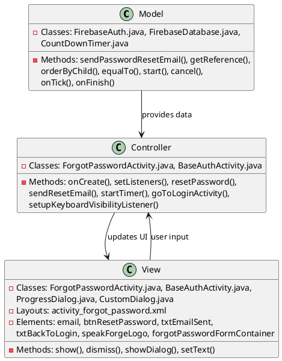
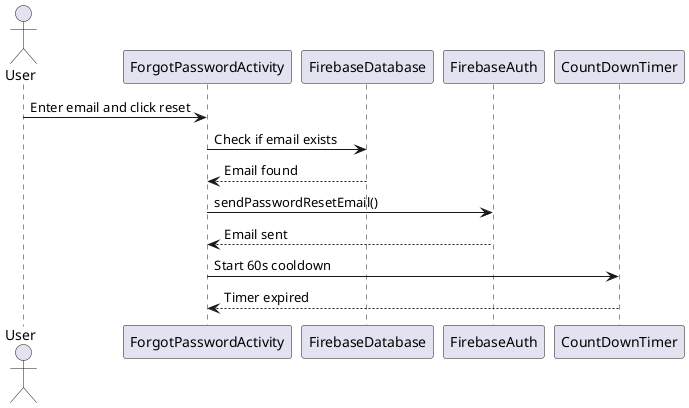
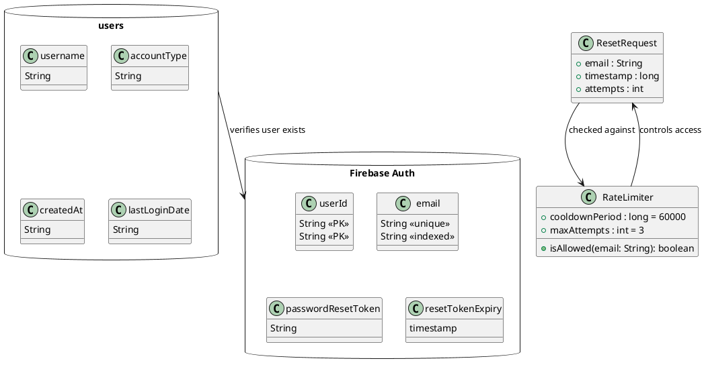

# 1.4 Forgot Password

## Front-end Components

- **ForgotPasswordActivity**: Main password recovery screen extending BaseAuthActivity
  - Email EditText: Input field for registered email address
  - Reset Password Button: Triggers password reset email process
  - Back to Login TextView: Link to return to login screen
  - Email Sent Label: Confirmation message displayed after successful reset

- **BaseAuthActivity**: Base class providing common authentication UI elements
  - Logo ImageView: App branding with scale-fade animations
  - Form container: Holds recovery form with slide-up animation
  - Keyboard visibility handling for dynamic UI adjustments

- **UI Components**:
  - ProgressDialog: Loading indicator during email sending
  - CustomDialog: Error message displays
  - CountDownTimer: Rate limiting timer preventing spam reset requests
  - AnimationUtils: Scale-fade and slide-up transitions

## Back-end Components

- **FirebaseAuth**: Firebase authentication service
  - sendPasswordResetEmail(): Sends password recovery email to user
  - onCompleteListener: Handles email sending completion
  - Exception handling for network or service errors

- **FirebaseDatabase**: Real-time database for email verification
  - users collection query: Checks if email exists in registered users
  - orderByChild("email"): Database query by email field
  - equalTo(emailAddress): Filters results to specific email
  - ValueEventListener: Handles database query completion

- **Rate Limiting Logic**: Prevents abuse of password reset functionality
  - CountDownTimer: 60-second cooldown between reset attempts
  - Button state management: Disables reset button during cooldown
  - Timer display: Shows remaining cooldown time to user

## Plant UML Diagrams

### Class Diagram (MVC Model)

### Sequence Diagram

### Data Design Diagram

