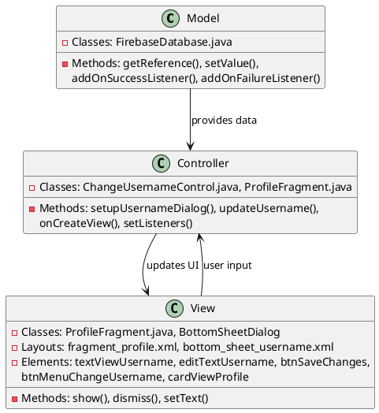
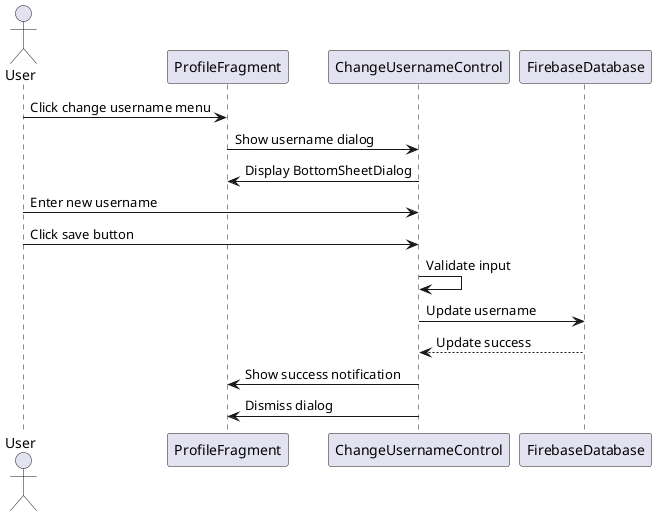
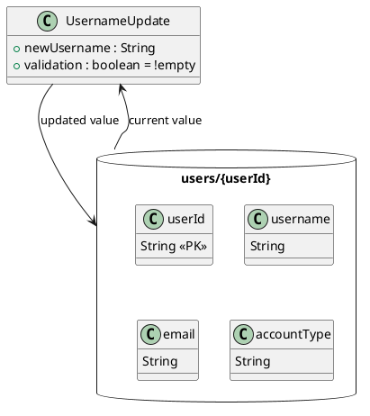

# 2.1 Change Display Name

## Front-end Components

- **ProfileFragment**: Main profile screen displaying user information
  - Username TextView: Shows current display name
  - Menu button for username change: Triggers display name modification

- **ChangeUsernameControl**: Controller handling username change operations
  - BottomSheetDialog: Modal dialog for username input
  - EditText for username input: Text field for new display name
  - Save button: Confirms username change

- **UI Layout (fragment_profile.xml)**: Profile screen layout
  - Elements: textViewUsername, btnMenuChangeUsername, cardViewProfile
  - Bottom sheet layout for username editing

## Back-end Components

- **FirebaseDatabase**: Real-time database for user data storage
  - users/{userId}/username reference: Stores display name
  - setValue(): Updates username in database
  - onSuccess/onFailure listeners: Handle update completion

- **ChangeUsernameControl**: Business logic for username management
  - updateUsername(): Validates and saves new username
  - Input validation: Ensures username is not empty

## Plant UML Diagrams

### Class Diagram (MVC Model)

### Sequence Diagram

### Data Design Diagram

