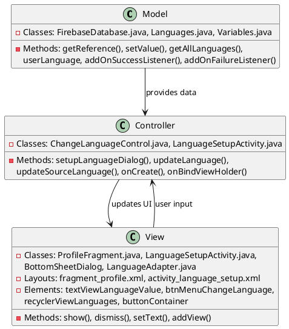
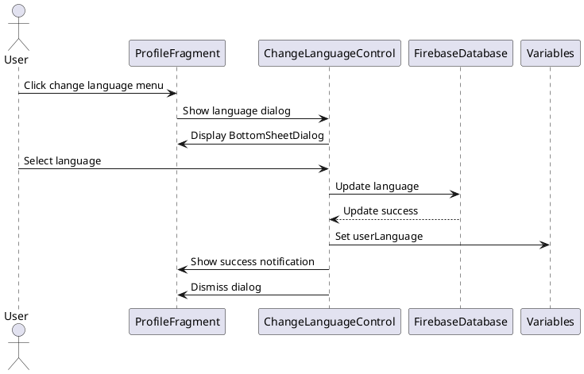
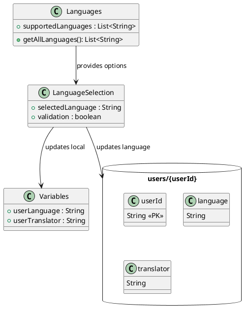

# 2.2 Change Preferred Language

## Front-end Components

- **ProfileFragment**: Main profile screen with language selection
  - Language display TextView: Shows current preferred language
  - Menu button for language change: Opens language selection

- **ChangeLanguageControl**: Controller managing language selection
  - BottomSheetDialog: Language selection modal
  - RecyclerView with LanguageAdapter: List of available languages
  - Language selection handling: Updates user preference

- **LanguageSetupActivity**: Dedicated activity for initial language setup
  - Dynamic button generation: Creates language selection buttons
  - Language selection buttons: Individual buttons for each language

## Back-end Components

- **FirebaseDatabase**: Stores user language preference
  - users/{userId}/language reference: Language setting storage
  - setValue(): Updates language in database
  - Real-time synchronization: Updates UI when language changes

- **Languages Model**: Language data management
  - getAllLanguages(): Returns list of supported languages
  - Language validation: Ensures selected language is valid

- **Variables Class**: Application-wide language storage
  - userLanguage: Stores current language setting
  - Language persistence: Maintains language across sessions

## Plant UML Diagrams

### Class Diagram (MVC Model)

### Sequence Diagram

### Data Design Diagram

