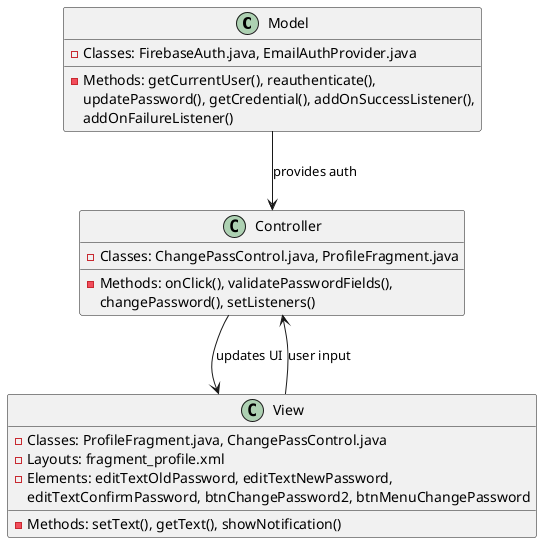
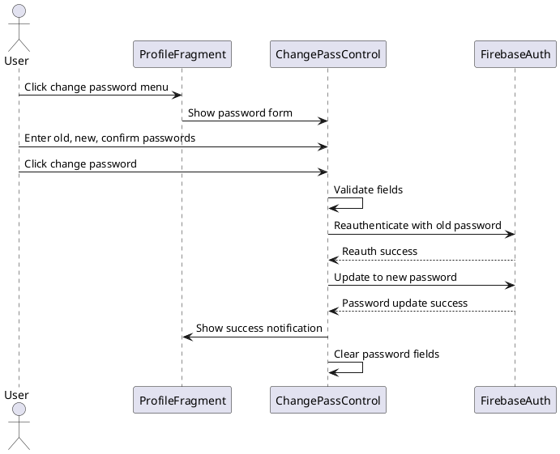
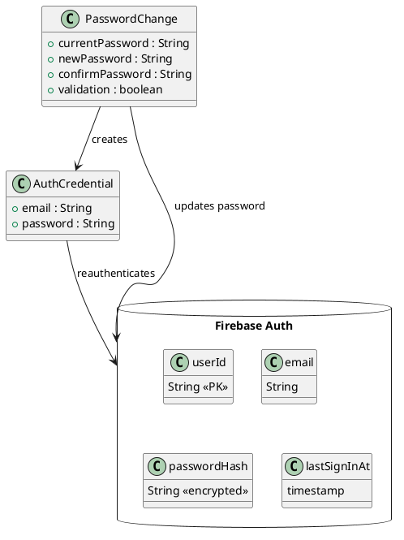

# 2.3 Change Password

## Front-end Components

- **ProfileFragment**: Profile screen with password change option
  - Menu button for password change: Opens password modification form
  - Password change form: Shows when password menu is selected

- **ChangePassControl**: Controller managing password change operations
  - Old password EditText: Current password input field
  - New password EditText: New password input field
  - Confirm password EditText: Password confirmation field
  - Change password button: Triggers password update

- **UI Layout (fragment_profile.xml)**: Profile screen layout
  - Elements: btnMenuChangePassword, editTextOldPassword,
    editTextNewPassword, editTextConfirmPassword, btnChangePassword2

## Back-end Components

- **FirebaseAuth**: Firebase authentication service for password management
  - reauthenticate(): Verifies current password before change
  - updatePassword(): Changes user password in Firebase Auth
  - EmailAuthProvider.getCredential(): Creates auth credential for reauth

- **ChangePassControl**: Business logic for password change
  - validatePasswordFields(): Validates all password fields
  - changePassword(): Orchestrates password update process
  - Input validation: Checks empty fields and password matching

- **Security Measures**: Password change security
  - Reauthentication required: Must provide current password
  - Password confirmation: Ensures new password is entered correctly

## Plant UML Diagrams

### Class Diagram (MVC Model)

### Sequence Diagram

### Data Design Diagram

