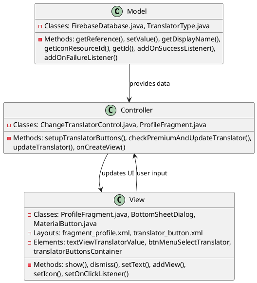
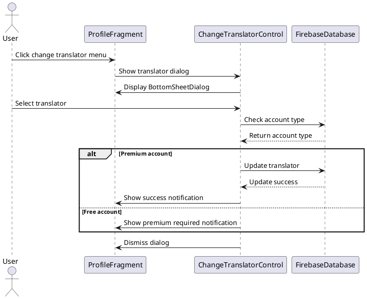
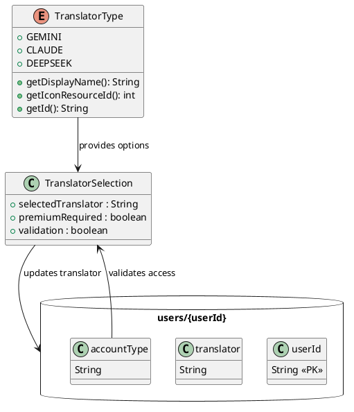

# 2.4 Change Preferred Translator

## Front-end Components

- **ProfileFragment**: Profile screen with translator selection
  - Translator display TextView: Shows current preferred translator
  - Menu button for translator change: Opens translator selection

- **ChangeTranslatorControl**: Controller managing translator selection
  - Dynamic translator buttons: Generated buttons for each translator type
  - Translator button layout: Custom button layout with icons and names
  - BottomSheetDialog: Modal for translator selection

- **TranslatorType Enum**: Defines available translator options
  - getDisplayName(): Returns user-friendly translator name
  - getIconResourceId(): Returns translator icon resource
  - getId(): Returns translator identifier

## Back-end Components

- **FirebaseDatabase**: Stores user translator preference
  - users/{userId}/translator reference: Translator setting storage
  - users/{userId}/accountType reference: Premium status checking
  - setValue(): Updates translator in database

- **ChangeTranslatorControl**: Business logic for translator management
  - setupTranslatorButtons(): Creates dynamic translator selection UI
  - checkPremiumAndUpdateTranslator(): Validates premium status before change
  - updateTranslator(): Saves new translator preference

- **Premium Validation**: Access control for translator features
  - Account type checking: Ensures user has premium subscription
  - Feature gating: Restricts advanced translators to premium users

## Plant UML Diagrams

### Class Diagram (MVC Model)

### Sequence Diagram

### Data Design Diagram

