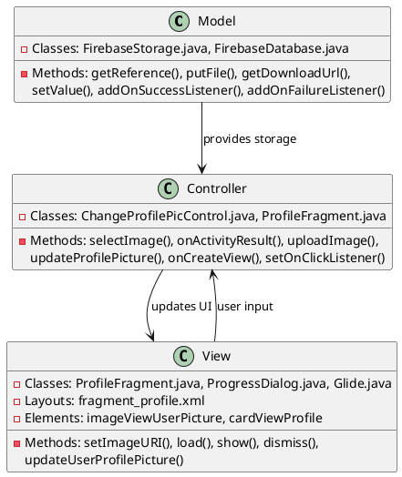
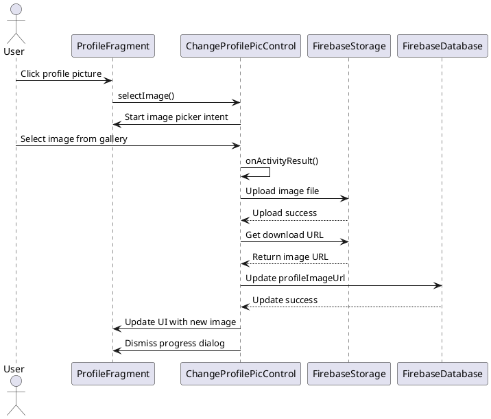

# 2.5 Change Profile Picture

## Front-end Components

- **ProfileFragment**: Profile screen with profile picture display
  - Profile ImageView: Shows current user profile picture
  - Image click handler: Triggers image selection when tapped

- **ChangeProfilePicControl**: Controller managing profile picture operations
  - Image picker Intent: Opens device image gallery
  - ProgressDialog: Shows upload progress
  - Image display update: Refreshes UI after successful upload

- **UI Layout (fragment_profile.xml)**: Profile screen layout
  - Elements: imageViewUserPicture, cardViewProfile
  - Image loading: Uses Glide for profile picture display

## Back-end Components

- **FirebaseStorage**: Cloud storage for profile images
  - profile_pictures/{userId} reference: User-specific image storage
  - putFile(): Uploads selected image to cloud storage
  - getDownloadUrl(): Retrieves public URL of uploaded image

- **FirebaseDatabase**: Stores profile picture URL
  - users/{userId}/profileImageUrl reference: Image URL storage
  - setValue(): Updates profile picture URL in user profile

- **ChangeProfilePicControl**: Business logic for image management
  - selectImage(): Initiates image selection from device
  - uploadImage(): Handles image upload to Firebase Storage
  - updateProfilePicture(): Saves image URL to user profile

## Plant UML Diagrams

### Class Diagram (MVC Model)



### Sequence Diagram



### Data Design Diagram

```plantuml
@startuml Change Profile Picture Data Design Diagram

database "Firebase Storage" as Storage {
  profile_pictures/{userId} : image file
  +getDownloadUrl(): String
  +putFile(uri): UploadTask
}

database "users/{userId}" as UserDB {
  userId : String <<PK>>
  profileImageUrl : String
}

class ImageUpload {
  +selectedImageUri : Uri
  +uploadedImageUrl : String
  +uploadProgress : int
}

Storage --> ImageUpload : stores file
ImageUpload --> UserDB : saves URL
UserDB --> ProfileFragment : displays image

@enduml
```
