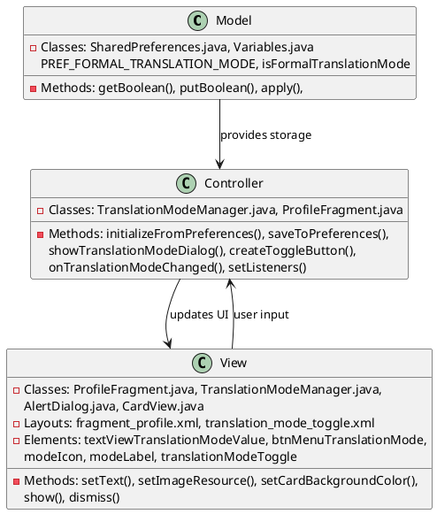
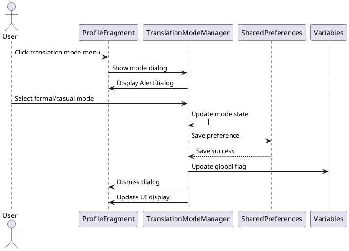
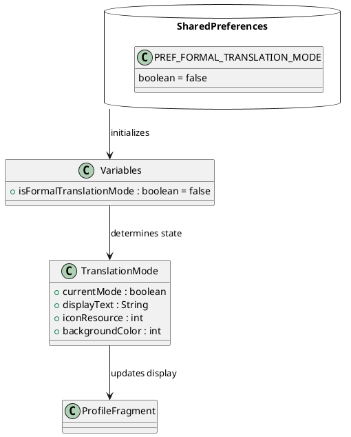

# 2.6 Toggle Translation Mode (Formal/Casual)

## Front-end Components

- **ProfileFragment**: Profile screen with translation mode toggle
  - Translation mode display TextView: Shows current mode (Formal/Casual)
  - Menu button for translation mode: Opens mode selection dialog

- **TranslationModeManager**: Utility class managing translation mode UI
  - Floating toggle button: CardView with icon and label for mode switching
  - AlertDialog: Selection dialog for formal/casual mode choice
  - Visual indicators: Different colors and icons for each mode

- **Translation Mode Toggle Layout**: Custom toggle button layout
  - CardView container: Clickable toggle area
  - ImageView icon: Visual representation of current mode
  - TextView label: "Formal" or "Casual" text display

## Back-end Components

- **SharedPreferences**: Local storage for translation mode preference
  - PREF_FORMAL_TRANSLATION_MODE: Boolean flag for formal mode setting
  - Persistent storage: Maintains setting across app sessions

- **TranslationModeManager**: Business logic for mode management
  - initializeFromPreferences(): Loads saved mode on app start
  - saveToPreferences(): Persists mode changes to storage
  - showTranslationModeDialog(): Presents mode selection options

- **Variables Class**: Global translation mode state
  - isFormalTranslationMode: Application-wide boolean flag
  - Real-time updates: Reflects current translation mode setting

## Plant UML Diagrams

### Class Diagram (MVC Model)

### Sequence Diagram

### Data Design Diagram

