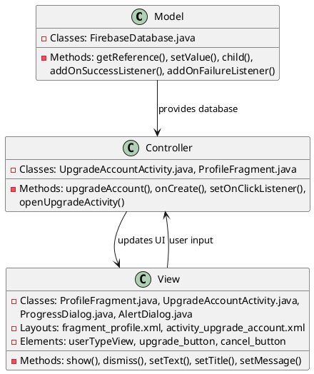
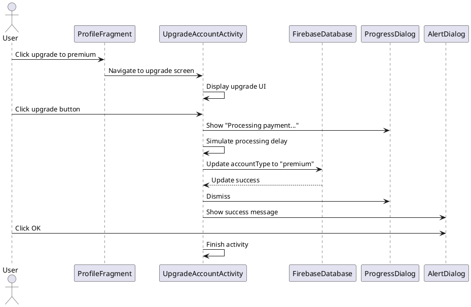
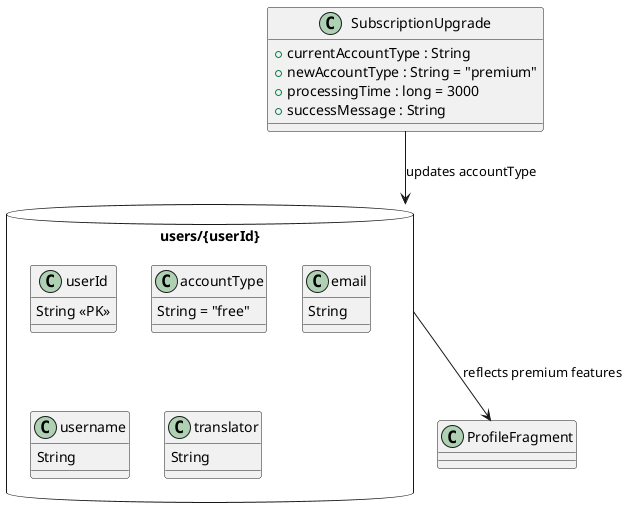

# 2.7 Manage Premium Subscription

## Front-end Components

- **ProfileFragment**: Profile screen with premium upgrade option
  - User type display: Shows current account type (free/premium)
  - Upgrade button: Initiates premium subscription process

- **UpgradeAccountActivity**: Dedicated upgrade screen
  - Upgrade button: Confirms subscription purchase
  - Cancel button: Returns to previous screen
  - Progress indicator: Shows processing status during upgrade

- **AlertDialog**: Success confirmation dialog
  - Title and message: Confirms successful upgrade
  - OK button: Dismisses dialog and returns to profile

## Back-end Components

- **FirebaseDatabase**: Updates user account type
  - users/{userId}/accountType reference: Account type storage
  - setValue("premium"): Updates user to premium status

- **UpgradeAccountActivity**: Business logic for subscription management
  - upgradeAccount(): Handles premium upgrade process
  - Account type update: Changes user status in database
  - Success feedback: Confirms upgrade completion to user

- **ProgressDialog**: Processing feedback during upgrade
  - Loading indicator: Shows "Processing payment..." message
  - Timed operation: Simulates payment processing delay

## Plant UML Diagrams

### Class Diagram (MVC Model)

### Sequence Diagram

### Data Design Diagram

