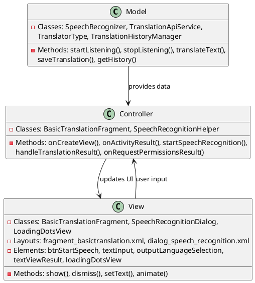
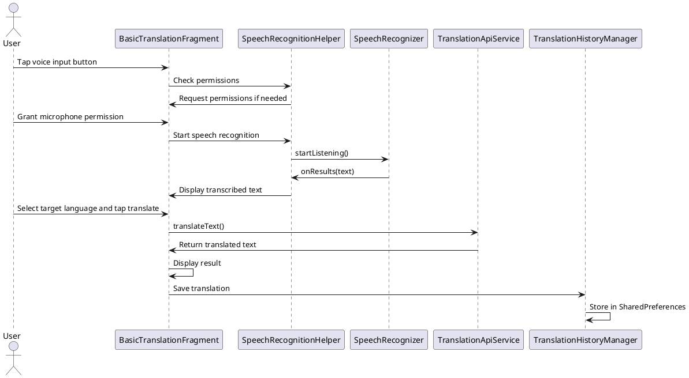

# 3.1 Voice-to-Text (Single Screen) Translation

## Front-end Components

- **BasicTranslationFragment**: Main translation interface with single screen layout
  - Floating Action Button for voice input: Triggers speech recognition
  - Text input field: Shows transcribed speech text
  - Language selection spinner: Target language for translation
  - Translate button: Initiates translation process

- **SpeechRecognitionDialog**: Modal dialog for voice input
  - Voice status display: Shows recording state
  - Real-time speech visualization: Indicates active recording
  - Stop/cancel controls: Ends voice input session

- **SpeechRecognitionHelper**: Manages speech recognition lifecycle
  - Permission handling: Requests microphone permissions
  - SpeechRecognizer setup: Configures Android speech recognition
  - Audio processing: Converts speech to text

## Back-end Components

- **SpeechRecognizer**: Android speech recognition service
  - RecognizerIntent: Configures speech recognition parameters
  - onResults callback: Processes recognized speech text
  - Error handling: Manages recognition failures

- **TranslationApiService**: Handles translation API calls
  - AsyncTask execution: Performs translation in background
  - API communication: Calls selected translation provider
  - Result processing: Formats translated text

- **TranslatorType**: Defines available translation services
  - Service selection: Google, Claude, DeepSeek translators
  - API configuration: Different endpoints and parameters

- **TranslationHistoryManager**: Saves translation records
  - History persistence: Stores voice-to-text translations
  - User-specific storage: Separate history per user

## Plant UML Diagrams

### Class Diagram (MVC Model)



### Sequence Diagram



### Data Design Diagram

```plantuml
@startuml Voice-to-Text Single Screen Data Design Diagram

database "SharedPreferences" as Prefs {
  translation_history : String <<JSON>>
  history_list_{userId} : List<TranslationHistory>
}

class TranslationHistory {
  +originalText : String
  +translatedText : String
  +fromLanguage : String
  +toLanguage : String
  +translator : String
  +timestamp : long
}

class SpeechResult {
  +transcribedText : String
  +confidence : float
  +language : String
}

class TranslationRequest {
  +text : String
  +fromLanguage : String
  +toLanguage : String
  +translatorType : String
}

SpeechResult --> TranslationRequest : provides text
TranslationRequest --> TranslationApiService : sent to
TranslationHistory --> Prefs : persisted in

@enduml
```
