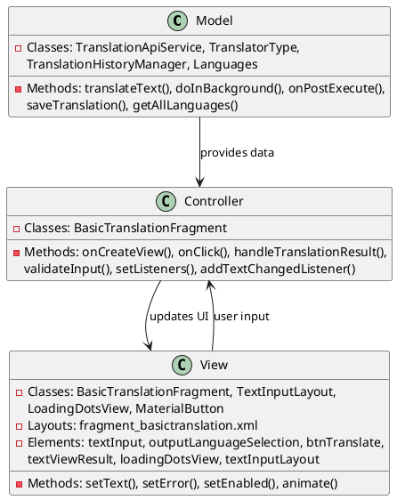
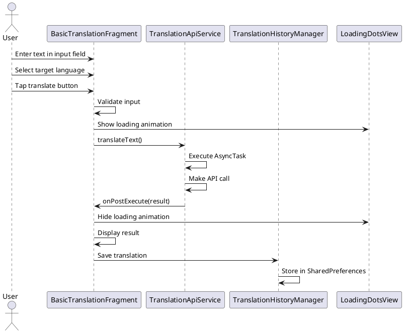

# 3.2 Text-to-Text Translation

## Front-end Components

- **BasicTranslationFragment**: Main translation interface for text input
  - Text input field: Multi-line text input for source text
  - Language selection spinner: Target language dropdown
  - Translate button: Initiates translation process
  - Result display area: Shows translated text

- **TextInputLayout**: Material Design text input wrapper
  - Input validation: Real-time input validation
  - Error display: Shows validation messages
  - Character counter: Optional character limits

- **MaterialButton**: Translation trigger button
  - Loading states: Shows progress during translation
  - State management: Enabled/disabled based on input

- **LoadingDotsView**: Visual loading indicator
  - Animated dots: Shows translation in progress
  - Position-based animation: Sequential dot animation

## Back-end Components

- **TranslationApiService**: Handles translation API communication
  - AsyncTask implementation: Background translation processing
  - HTTP requests: REST API calls to translation services
  - JSON parsing: Processes API responses

- **TranslatorType**: Translation service configuration
  - Service enumeration: Google, Claude, DeepSeek options
  - API endpoints: Different service URLs and parameters
  - Authentication: API keys and headers

- **TranslationHistoryManager**: Records translation history
  - History persistence: Saves text-to-text translations
  - User isolation: Separate history per user account
  - Size limits: Automatic cleanup of old entries

- **Languages Model**: Language data management
  - Language list: Available translation languages
  - Language codes: ISO language identifiers
  - Display names: User-friendly language names

## Plant UML Diagrams

### Class Diagram (MVC Model)



### Sequence Diagram



### Data Design Diagram

```plantuml
@startuml Text-to-Text Translation Data Design Diagram

database "SharedPreferences" as Prefs {
  translation_history : String <<JSON>>
  history_list_{userId} : List<TranslationHistory>
}

class TranslationHistory {
  +originalText : String
  +translatedText : String
  +fromLanguage : String
  +toLanguage : String
  +translator : String
  +timestamp : long
}

class Languages {
  +languageList : List<String>
  +getAllLanguages(): List<String>
  +getLanguageCode(name: String): String
}

class TranslationRequest {
  +text : String
  +fromLanguage : String
  +toLanguage : String
  +translatorType : String
  +apiKey : String
}

class TranslationResponse {
  +translatedText : String
  +status : String
  +error : String
}

TranslationRequest --> TranslationApiService : sent to
TranslationApiService --> TranslationResponse : returns
TranslationHistory --> Prefs : persisted in

@enduml
```
