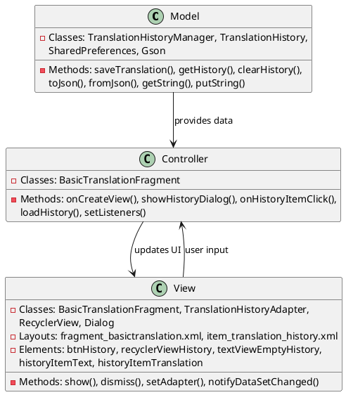
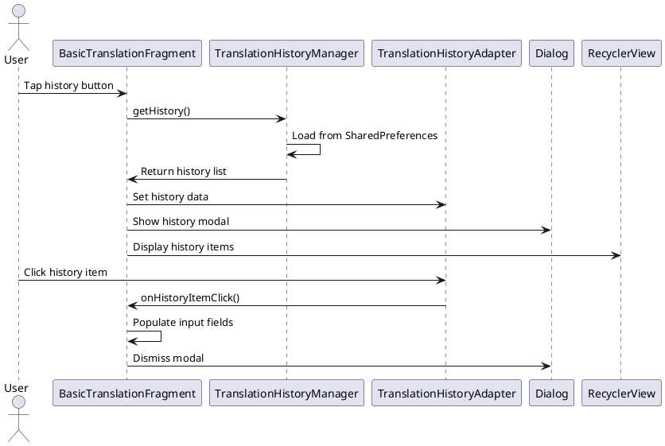

# 3.3 Translation History

## Front-end Components

- **BasicTranslationFragment**: Main translation screen with history access
  - History button: Opens translation history modal
  - History display: Shows previous translations

- **TranslationHistoryAdapter**: RecyclerView adapter for history items
  - History item layout: Individual translation display
  - Click handling: Reuse translation or view details
  - List management: Display order and filtering

- **RecyclerView**: History list container
  - LinearLayoutManager: Vertical scrolling layout
  - Item animations: Smooth scrolling and transitions
  - Empty state: Shows message when no history exists

- **Dialog/Modal**: History display container
  - Full-screen modal: Dedicated history viewing
  - Close button: Dismiss history view
  - Search/filter: Optional history filtering

## Back-end Components

- **TranslationHistoryManager**: History data management
  - SharedPreferences storage: Local history persistence
  - User-specific keys: Isolated history per user
  - Size management: Automatic cleanup (50 item limit)

- **TranslationHistory Model**: History data structure
  - Translation metadata: Original text, translation, languages
  - Timestamp tracking: When translation occurred
  - Translator identification: Which service was used

- **Gson**: JSON serialization/deserialization
  - History persistence: Convert objects to JSON
  - History retrieval: Parse JSON back to objects
  - Type safety: Maintain data integrity

- **SharedPreferences**: Local storage mechanism
  - Key-value storage: Simple data persistence
  - App-private storage: Secure local data
  - Cross-session persistence: Data survives app restarts

## Plant UML Diagrams

### Class Diagram (MVC Model)



### Sequence Diagram



### Data Design Diagram

```plantuml
@startuml Translation History Data Design Diagram

database "SharedPreferences" as Prefs {
  translation_history : String <<JSON>>
  history_list_{userId} : List<TranslationHistory>
}

class TranslationHistory {
  +originalText : String
  +translatedText : String
  +fromLanguage : String
  +toLanguage : String
  +translator : String
  +timestamp : long
}

class HistoryMetadata {
  +userId : String
  +maxItems : int = 50
  +storageKey : String
}

class HistoryFilter {
  +dateRange : DateRange
  +language : String
  +translator : String
}

TranslationHistory --> Prefs : serialized to
HistoryMetadata --> Prefs : manages storage
HistoryFilter --> TranslationHistory : filters list

@enduml
