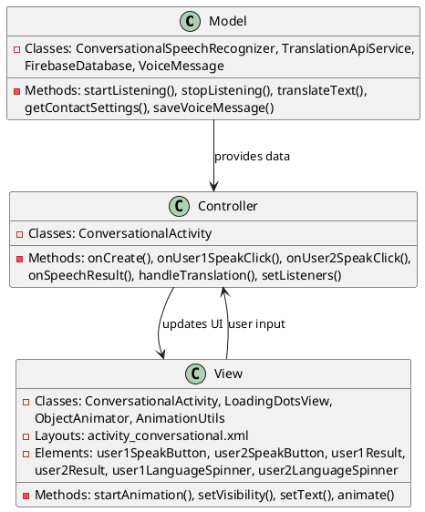
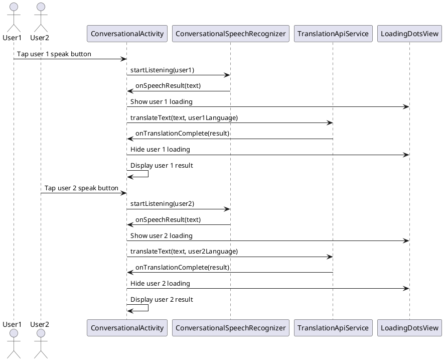

# 3.4 Voice-to-Text (Split Screen) Translation

## Front-end Components

- **ConversationalActivity**: Split-screen voice translation interface
  - Dual user sections: Top and bottom panels for two users
  - Voice input buttons: Individual FABs for each user section
  - Language spinners: Language selection for each user
  - Result text views: Display transcribed and translated text

- **ConversationalSpeechRecognizer**: Manages dual speech recognition
  - Alternating recognition: Handles speech from user 1 or user 2
  - State management: Tracks which user is currently speaking
  - Speech processing: Converts speech to text for active user

- **LoadingDotsView**: Visual feedback for translation processing
  - Dual indicators: Separate loading animations for each user
  - Position-based display: Shows processing state per user section

- **Animation Framework**: Smooth transitions and visual effects
  - Slide animations: Entry animations for split-screen sections
  - Object animators: Smooth transitions between states
  - Interpolators: Custom animation timing and easing

## Back-end Components

- **TranslationApiService**: Handles real-time translation requests
  - AsyncTask processing: Background translation for each user
  - Concurrent requests: Handles multiple simultaneous translations
  - Result routing: Delivers translated text to correct user section

- **FirebaseDatabase**: Contact and settings synchronization
  - Contact settings: Retrieves translation preferences per contact
  - Language preferences: Loads recipient language settings
  - Real-time updates: Monitors contact translator preferences

- **VoiceMessage Model**: Data structure for voice conversations
  - Message metadata: User IDs, timestamps, language info
  - Content storage: Original and translated message content
  - Conversation threading: Links messages in conversation flow

- **Contact Settings**: Per-contact translation preferences
  - Translation toggles: Enable/disable translation per contact
  - Language overrides: Custom language settings per contact
  - Translator selection: Different services per contact

## Plant UML Diagrams

### Class Diagram (MVC Model)



### Sequence Diagram



### Data Design Diagram

```plantuml
@startuml Voice-to-Text Split Screen Data Design Diagram

database "Firebase Database" as FirebaseDB {
  voiceMessages/{roomId}/{messageId} : VoiceMessage
  users/{userId}/contactsettings/{contactId} : ContactSettings
}

class VoiceMessage {
  +messageId : String <<PK>>
  +senderId : String
  +recipientId : String
  +originalText : String
  +translatedText : String
  +fromLanguage : String
  +toLanguage : String
  +translator : String
  +timestamp : long
  +roomId : String
}

class ContactSettings {
  +contactId : String <<PK>>
  +translateMessages : boolean = false
  +preferredLanguage : String
  +preferredTranslator : String
}

class ConversationState {
  +currentSpeaker : User
  +user1Language : String
  +user2Language : String
  +isUser1Speaking : boolean
  +isUser2Speaking : boolean
}

VoiceMessage --> FirebaseDB : stored in
ContactSettings --> FirebaseDB : stored in
ConversationState --> ConversationalActivity : manages

@enduml
```
