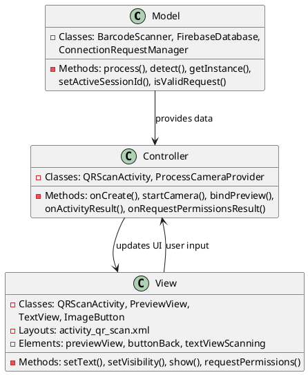
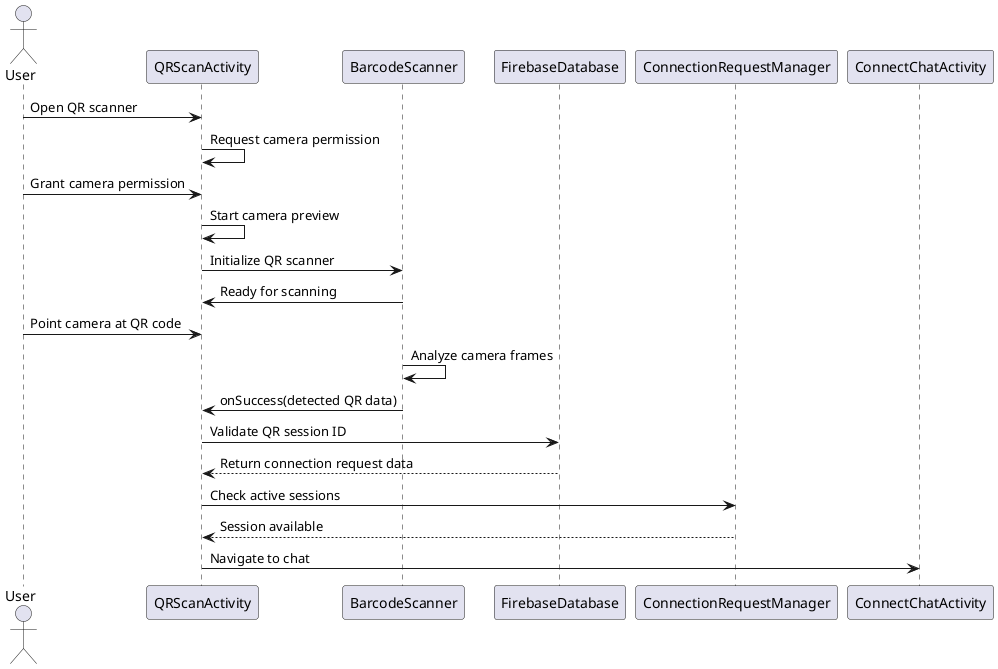

# 4.1 QR Code Connection

## Front-end Components

- **QRScanActivity**: Camera-based QR code scanning interface
  - PreviewView: Camera preview for QR code scanning
  - ImageButton back button: Navigation back to previous screen
  - TextView scanning status: Shows scanning progress/instructions

- **BarcodeScanner**: ML Kit barcode scanning client
  - QR code format detection: Specialized for QR code recognition
  - Real-time analysis: Continuous camera frame processing

- **CameraX**: Android Jetpack camera management
  - ProcessCameraProvider: Camera lifecycle management
  - ImageAnalysis: Real-time frame analysis for QR codes
  - Camera permissions: Runtime camera access handling

## Back-end Components

- **FirebaseDatabase**: Connection request management
  - Connection requests lookup: Validates scanned QR code data
  - Session ID validation: Ensures QR code corresponds to valid connection
  - Real-time request monitoring: Checks request status and acceptance

- **ConnectionRequestManager**: Manages connection request lifecycle
  - Active session tracking: Prevents duplicate session openings
  - Request state management: Handles pending/accepted/rejected states
  - Session isolation: Ensures one active connection per user

- **Camera Permission Handling**: Android permission system
  - Runtime permission requests: CAMERA permission management
  - Permission callbacks: Handles grant/deny responses
  - Graceful degradation: Alternative UI when permission denied

## Plant UML Diagrams

### Class Diagram (MVC Model)



### Sequence Diagram



### Data Design Diagram

```plantuml
@startuml QR Code Connection Data Design Diagram

database "Firebase Database" as FirebaseDB {
  connection_requests/{requestId} : ConnectionRequest
  connect_chats/{sessionId} : ChatSession
}

class ConnectionRequest {
  +requestId : String <<PK>>
  +senderId : String
  +recipientId : String
  +sessionId : String
  +status : String <<pending/accepted/rejected>>
  +createdAt : timestamp
  +qrData : String
}

class QRCode {
  +data : String
  +sessionId : String <<embedded>>
  +timestamp : long
  +validityPeriod : long = 300000
}

class CameraFrame {
  +image : Image
  +rotationDegrees : int
  +timestamp : long
}

BarcodeScanner --> CameraFrame : analyzes
CameraFrame --> QRCode : extracts data
QRCode --> ConnectionRequest : references

@enduml
```
