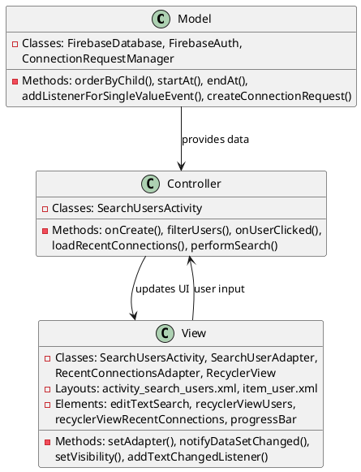
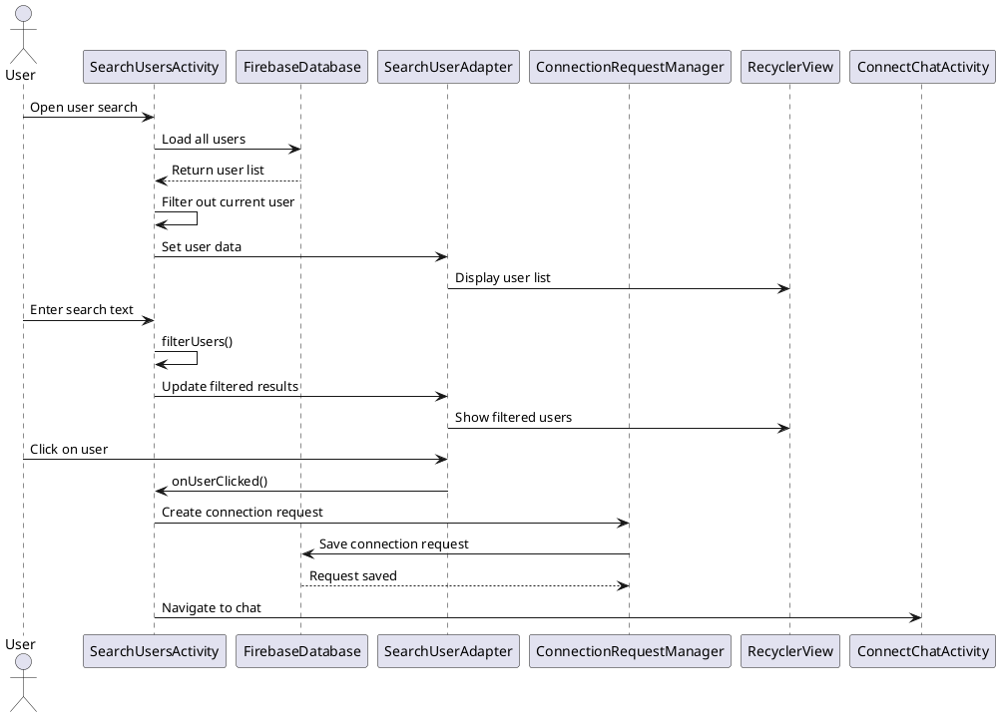

# 4.2 User Search & Connect

## Front-end Components

- **SearchUsersActivity**: User discovery and connection interface
  - EditText search field: Real-time user search input
  - RecyclerView search results: Displays filtered user list
  - RecyclerView recent connections: Horizontal list of recent contacts
  - ProgressBar: Loading indicator during search

- **SearchUserAdapter**: RecyclerView adapter for search results
  - User item layout: Individual user display with profile info
  - Click handling: Initiates connection requests
  - Online status indicators: Shows user availability

- **RecentConnectionsAdapter**: Horizontal adapter for recent contacts
  - Recent user layout: Compact user display format
  - Quick connect buttons: Fast reconnection to recent users

## Back-end Components

- **FirebaseDatabase**: User data and connection management
  - users collection: Searches user profiles by username/email
  - Real-time user data: Fetches profile images and status
  - Connection request creation: Initiates chat session requests

- **FirebaseAuth**: User authentication and identity
  - Current user identification: Excludes self from search results
  - User ID management: Unique identifier handling

- **ConnectionRequestManager**: Handles connection workflow
  - Request creation: Generates connection requests
  - Duplicate prevention: Checks existing connections
  - Status tracking: Monitors request acceptance/rejection

- **Search Filtering**: Client-side user filtering
  - Real-time search: Filters users as text is entered
  - Case-insensitive matching: Username and email search
  - Self-exclusion: Removes current user from results

## Plant UML Diagrams

### Class Diagram (MVC Model)



### Sequence Diagram



### Data Design Diagram

```plantuml
@startuml User Search & Connect Data Design Diagram

database "Firebase Database" as FirebaseDB {
  users/{userId} : UserProfile
  connection_requests/{requestId} : ConnectionRequest
  connect_chats/{sessionId} : ChatSession
}

class UserProfile {
  +userId : String <<PK>>
  +username : String <<indexed>>
  +email : String <<indexed>>
  +profileImageUrl : String
  +language : String
  +accountType : String
  +lastActive : timestamp
}

class SearchQuery {
  +searchText : String
  +filterType : String <<username/email>>
  +caseSensitive : boolean = false
}

class ConnectionRequest {
  +requestId : String <<PK>>
  +senderId : String
  +recipientId : String
  +sessionId : String
  +status : String = "pending"
  +createdAt : timestamp
}

SearchQuery --> UserProfile : filters
UserProfile --> ConnectionRequest : initiates
ConnectionRequest --> ChatSession : creates

@enduml
```
