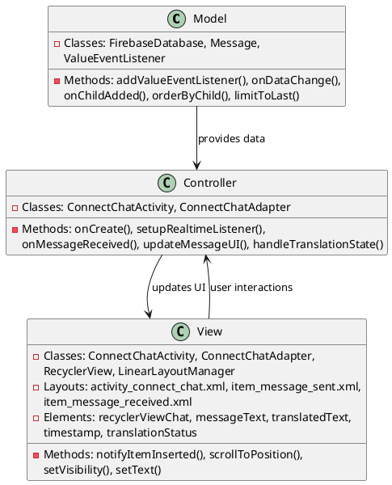
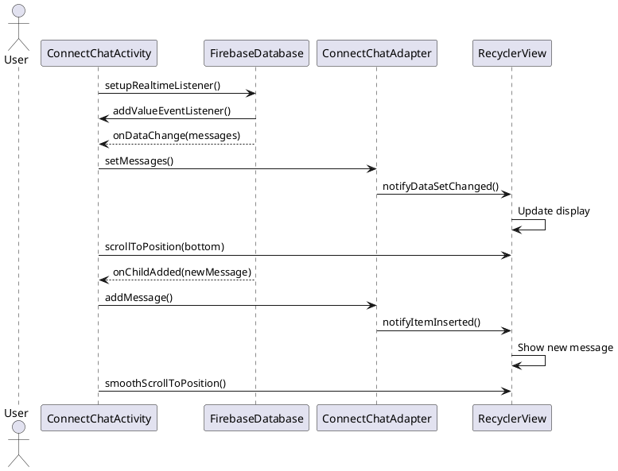

# 4.3 Real-Time Text Display

## Front-end Components

- **ConnectChatActivity**: Real-time chat interface
  - RecyclerView chat display: Shows message conversation
  - ConnectChatAdapter: Manages message display and updates
  - Auto-scrolling: Keeps latest messages visible
  - Message timestamps: Shows when messages were sent

- **ConnectChatAdapter**: RecyclerView adapter for chat messages
  - Message item layouts: Different layouts for sent/received messages
  - Real-time updates: Adds new messages as they arrive
  - Message status indicators: Shows translation states
  - Reply indicators: Highlights replied-to messages

- **Message Layouts**: Custom message display components
  - Sender message layout: Right-aligned sent messages
  - Receiver message layout: Left-aligned received messages
  - Translation display: Shows both original and translated text
  - Loading indicators: Shows translation progress

## Back-end Components

- **FirebaseDatabase**: Real-time message synchronization
  - connect_chats/{sessionId} reference: Session-specific messages
  - ValueEventListener: Monitors message changes
  - ChildEventListener: Handles message additions/updates
  - Offline persistence: Local message caching

- **Message Model**: Data structure for chat messages
  - Message metadata: Sender, timestamp, translation state
  - Content handling: Original text, translated text, voice data
  - Reply relationships: Links to replied messages
  - Session identification: Associates with chat sessions

- **Real-time Updates**: Live message synchronization
  - Event-driven updates: Automatic UI refresh on data changes
  - Message ordering: Chronological message display
  - Duplicate prevention: Handles Firebase event duplicates
  - Performance optimization: Efficient list updates

- **Translation State Management**: Message translation lifecycle
  - State tracking: TRANSLATING, TRANSLATED, FAILED states
  - UI state updates: Reflects current translation status
  - Error handling: Graceful failure states

## Plant UML Diagrams

### Class Diagram (MVC Model)



### Sequence Diagram



### Data Design Diagram

```plantuml
@startuml Real-Time Text Display Data Design Diagram

database "Firebase Database" as FirebaseDB {
  connect_chats/{sessionId}/{messageId} : Message
  users/{userId} : UserProfile
}

class Message {
  +messageId : String <<PK>>
  +senderId : String
  +message : String
  +translatedText : String
  +translationState : String <<TRANSLATING/TRANSLATED/FAILED>>
  +timestamp : long
  +senderLanguage : String
  +voiceText : String
  +isVoiceMessage : boolean
  +replyToMessageId : String
  +replyToSenderId : String
  +replyToMessage : String
}

class MessageDisplay {
  +message : Message
  +isCurrentUser : boolean
  +showTranslation : boolean
  +displayFormat : String <<sent/received>>
}

class RealtimeListener {
  +sessionId : String
  +lastMessageTimestamp : long
  +eventCount : int
}

Message --> MessageDisplay : formats for
MessageDisplay --> ConnectChatAdapter : displays in
RealtimeListener --> FirebaseDB : monitors

@enduml
```
