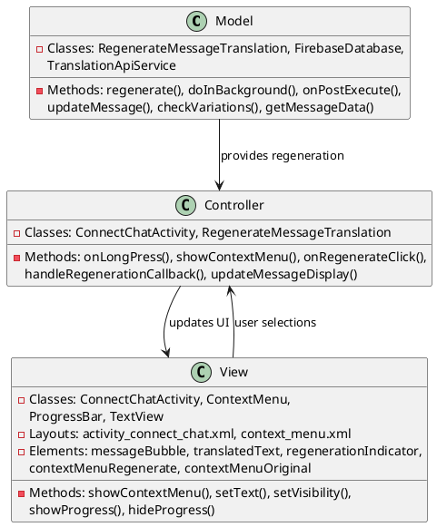
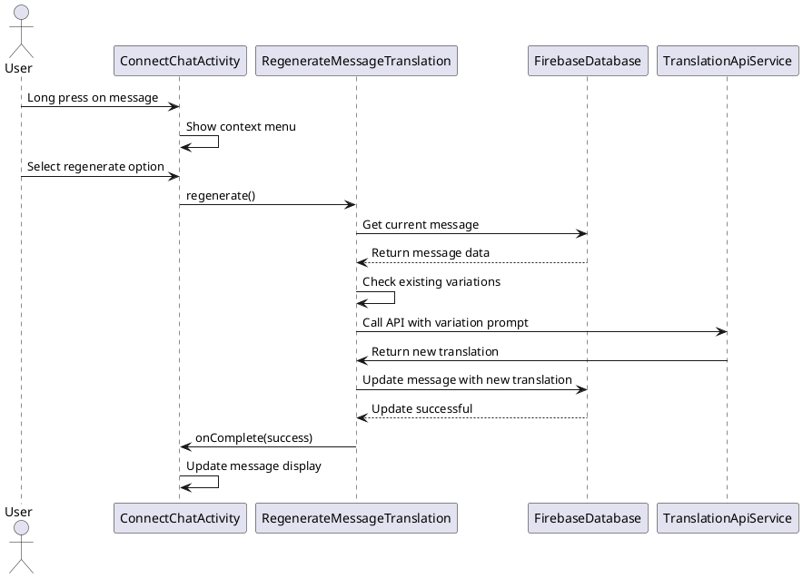

# 4.4 Regenerate Translated Text

## Front-end Components

- **ConnectChatActivity**: Chat interface with regeneration options
  - Message long-press menu: Context menu for message actions
  - Regenerate option: Menu item to trigger translation regeneration
  - Loading indicators: Shows regeneration progress on message

- **Message Context Menu**: Long-press interaction menu
  - Regenerate translation: Option to get alternative translation
  - Original message view: Option to see untranslated text
  - Reply functionality: Option to reply to specific messages

- **Translation Status Updates**: Real-time status indicators
  - Regeneration progress: Visual feedback during regeneration
  - Success/failure states: Updated message appearance
  - Alternative translation display: Shows new translation variant

## Back-end Components

- **RegenerateMessageTranslation**: Core regeneration controller
  - Variation generation: Creates different translation alternatives
  - Firebase integration: Updates messages in real-time database
  - API communication: Calls translation service with variation prompts

- **FirebaseDatabase**: Message update and synchronization
  - Message retrieval: Gets current message data for regeneration
  - Real-time updates: Pushes regenerated translations to all clients
  - Version tracking: Manages multiple translation variations

- **Translation Variation System**: Alternative translation generation
  - Prompt variation: Uses different translation prompts (standard/variation)
  - Context preservation: Maintains conversation context for accuracy
  - Quality assurance: Ensures alternative translations are valid

- **Callback System**: Asynchronous operation handling
  - RegenerationCallback: Interface for completion notifications
  - Success/failure handling: Reports regeneration outcomes
  - UI updates: Triggers interface refresh after regeneration

## Plant UML Diagrams

### Class Diagram (MVC Model)



### Sequence Diagram



### Data Design Diagram

```plantuml
@startuml Regenerate Translated Text Data Design Diagram

database "Firebase Database" as FirebaseDB {
  connect_chats/{sessionId}/{messageId} : Message
}

class Message {
  +messageId : String <<PK>>
  +message : String
  +translatedText : String
  +translations : Map<String, String>
  +translation1 : String
  +translation2 : String
  +translation3 : String
  +currentTranslationIndex : int
  +timestamp : long
}

class RegenerationRequest {
  +messageId : String
  +originalText : String
  +targetLanguage : String
  +variationPrompt : String
  +contextMessages : List<String>
}

class RegenerationResult {
  +newTranslation : String
  +variationNumber : int
  +qualityScore : float
  +processingTime : long
}

RegenerationRequest --> TranslationApiService : sent to
TranslationApiService --> RegenerationResult : returns
RegenerationResult --> Message : updates

@enduml
```
