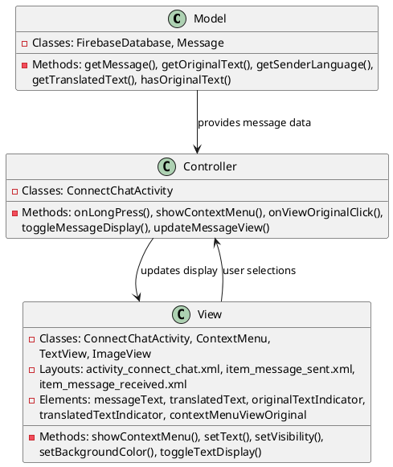
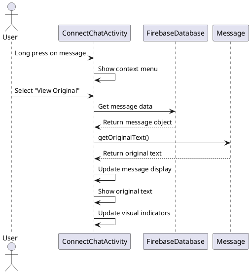

# 4.5 View Original Message

## Front-end Components

- **ConnectChatActivity**: Chat interface with message viewing options
  - Message long-press menu: Context menu for message interactions
  - View original option: Menu item to show untranslated message
  - Message display toggle: Switches between translated and original text

- **Message Context Menu**: Long-press interaction menu
  - View original message: Option to see untranslated sender text
  - View translated message: Option to see translated recipient text
  - Message details: Shows message metadata and sender info

- **Message Display States**: Dual text presentation
  - Original text view: Shows sender's original language text
  - Translated text view: Shows recipient's language translation
  - Toggle indicators: Visual cues for current display mode

## Back-end Components

- **Message Data Access**: Original message retrieval
  - Firebase message lookup: Retrieves stored original text
  - Message metadata: Access to sender language and original content
  - Data validation: Ensures original text is available

- **Display State Management**: UI state handling
  - Message view toggling: Switches between original/translated display
  - State persistence: Remembers user's preference per message
  - Visual feedback: Updates UI to reflect current view mode

- **Translation Toggle Logic**: Message presentation logic
  - Original text preservation: Maintains sender's exact wording
  - Language identification: Shows source language indicators
  - Context preservation: Keeps message meaning intact

## Plant UML Diagrams

### Class Diagram (MVC Model)



### Sequence Diagram



### Data Design Diagram

```plantuml
@startuml View Original Message Data Design Diagram

database "Firebase Database" as FirebaseDB {
  connect_chats/{sessionId}/{messageId} : Message
}

class Message {
  +messageId : String <<PK>>
  +message : String <<original text>>
  +translatedText : String
  +senderLanguage : String
  +recipientLanguage : String
  +isVoiceMessage : boolean
  +voiceText : String
  +timestamp : long
}

class MessageDisplayState {
  +messageId : String
  +showOriginal : boolean = false
  +showTranslated : boolean = true
  +lastToggleTime : long
}

class OriginalTextView {
  +originalText : String
  +senderLanguage : String
  +displayFormat : String <<with/without language indicator>>
}

Message --> MessageDisplayState : controls display of
MessageDisplayState --> OriginalTextView : formats

@enduml
```
