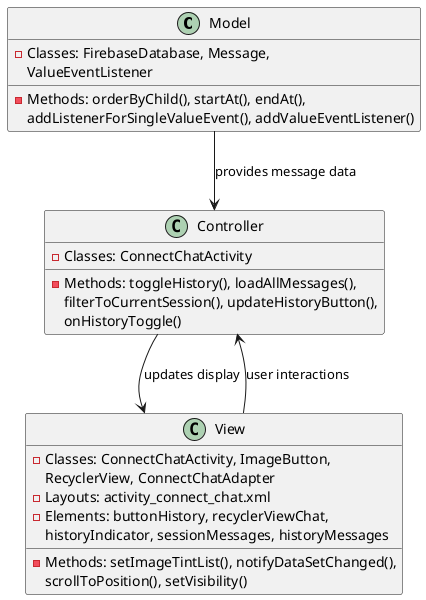
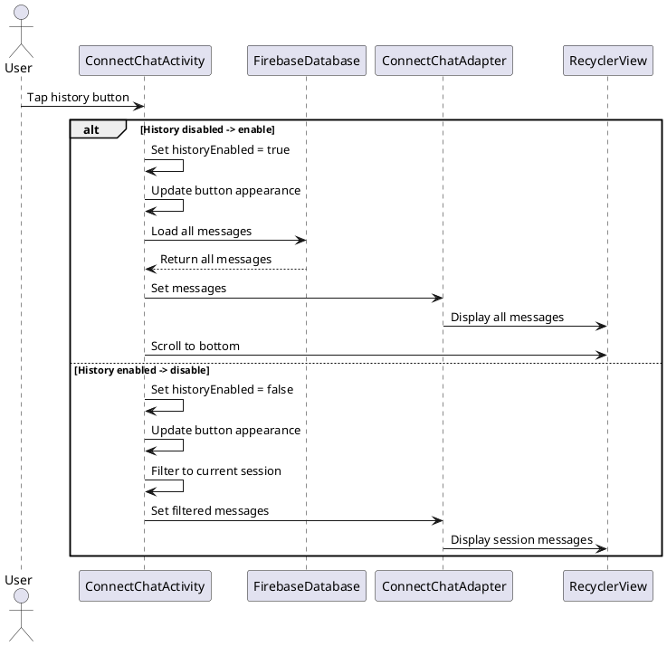

# 4.6 View Conversation History

## Front-end Components

- **ConnectChatActivity**: Chat interface with history toggle
  - History button: Toggle button to show/hide conversation history
  - History indicator: Visual cue showing history mode status
  - Message filtering: Displays current session vs all messages

- **History Toggle UI**: Visual history controls
  - Toggle button states: Different icons/colors for enabled/disabled
  - Status indicators: Shows when history mode is active
  - Transition animations: Smooth UI changes when toggling

- **Message Display Updates**: Dynamic message list changes
  - History expansion: Shows messages from all conversation sessions
  - Session filtering: Shows only current session messages
  - Scroll positioning: Maintains user's reading position

## Back-end Components

- **FirebaseDatabase**: Historical message retrieval
  - Session-based queries: Fetches messages by session ID
  - Time-based filtering: Separates current session from history
  - Message ordering: Chronological sorting of all messages

- **History State Management**: Toggle logic and persistence
  - State tracking: Remembers history view preference
  - Session boundaries: Tracks current session start time
  - Performance optimization: Efficient message loading strategies

- **Message Synchronization**: Real-time history updates
  - Live history updates: New messages appear in history view
  - Duplicate prevention: Avoids showing duplicate messages
  - Memory management: Handles large message histories efficiently

## Plant UML Diagrams

### Class Diagram (MVC Model)



### Sequence Diagram



### Data Design Diagram

```plantuml
@startuml View Conversation History Data Design Diagram

database "Firebase Database" as FirebaseDB {
  connect_chats/{sessionId}/{messageId} : Message
}

class Message {
  +messageId : String <<PK>>
  +senderId : String
  +message : String
  +timestamp : long
  +sessionId : String
  +isCurrentSession : boolean
}

class HistoryFilter {
  +sessionId : String
  +showHistory : boolean = false
  +currentSessionStartTime : long
  +maxHistoryItems : int = 1000
}

class MessageCollection {
  +allMessages : List<Message>
  +sessionMessages : List<Message>
  +historyMessages : List<Message>
  +lastUpdateTime : long
}

HistoryFilter --> MessageCollection : filters
MessageCollection --> ConnectChatAdapter : displays
FirebaseDatabase --> MessageCollection : populates

@enduml
```
