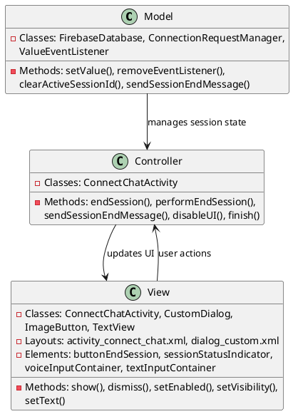
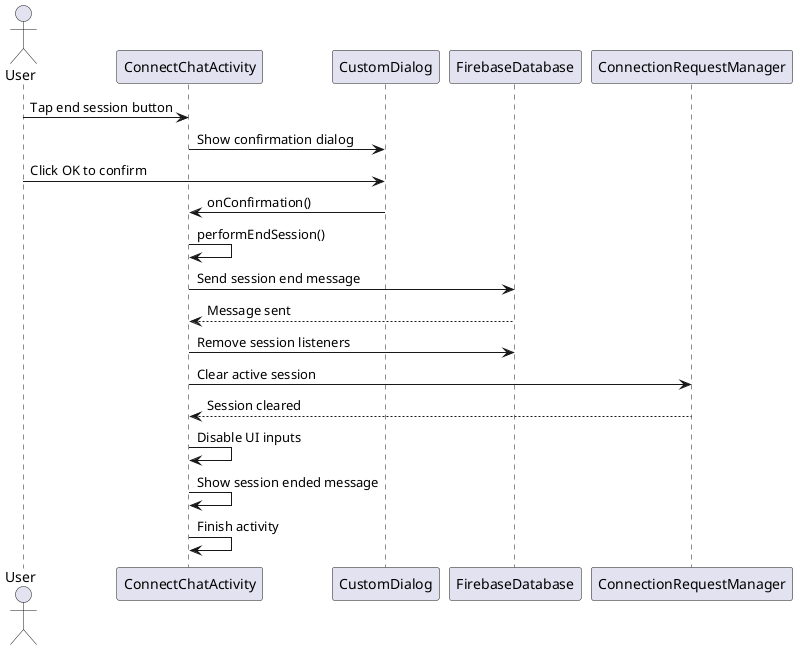

# 4.7 End Session

## Front-end Components

- **ConnectChatActivity**: Chat interface with session controls
  - End session button: Initiates session termination process
  - Confirmation dialog: Prevents accidental session ending
  - Session status indicators: Shows session state changes

- **CustomDialog**: Session ending confirmation
  - Warning message: Alerts user about session termination
  - Confirmation buttons: OK/Cancel options for session ending
  - Visual styling: Warning colors and icons

- **Session State UI Updates**: Interface changes during ending
  - Input disabling: Prevents new messages during ending process
  - Visual feedback: Shows session ended state
  - Navigation handling: Returns to appropriate screen

## Back-end Components

- **Session Management**: Session lifecycle handling
  - Session end messaging: Sends termination messages to other participants
  - Session cleanup: Removes listeners and clears active session state
  - State synchronization: Updates session status across clients

- **FirebaseDatabase**: Session state updates
  - Session end messages: Records session termination in chat history
  - Listener cleanup: Removes real-time listeners to prevent memory leaks
  - Connection management: Updates connection request status

- **ConnectionRequestManager**: Connection state management
  - Active session clearing: Removes current session from active tracking
  - Session isolation: Ensures clean separation between sessions
  - State persistence: Maintains connection history

## Plant UML Diagrams

### Class Diagram (MVC Model)



### Sequence Diagram



### Data Design Diagram

```plantuml
@startuml End Session Data Design Diagram

database "Firebase Database" as FirebaseDB {
  connect_chats/{sessionId}/{messageId} : Message
  connection_requests/{requestId} : ConnectionRequest
}

class SessionEndMessage {
  +messageId : String <<PK>>
  +senderId : String
  +messageText : String = "has left the session"
  +timestamp : long
  +isSessionEnd : boolean = true
  +sessionId : String
}

class SessionState {
  +sessionId : String
  +isActive : boolean = false
  +endTime : long
  +endedBy : String
  +participantCount : int
}

class ConnectionCleanup {
  +activeSessionId : String = null
  +listenersRemoved : List<ValueEventListener>
  +uiDisabled : boolean = true
}

SessionEndMessage --> FirebaseDatabase : stored as
SessionState --> ConnectionRequestManager : updates
ConnectionCleanup --> ConnectChatActivity : handles

@enduml
```
